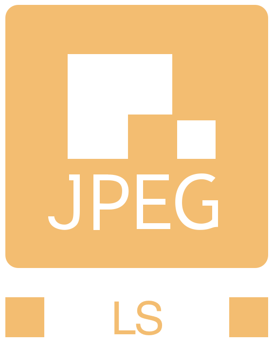

<!--
  SPDX-FileCopyrightText: © 2024 Team CharLS
  SPDX-License-Identifier: BSD-3-Clause
-->



# CharLS.Managed.ImageSharp .NET

[](https://github.com/team-charls/charls-dotnet-imagesharp/blob/main/LICENSE.md)
[](https://api.reuse.software/info/github.com/team-charls/charls-dotnet-imagesharp)
[](https://github.com/team-charls/charls-dotnet-imagesharp/actions/workflows/dotnet.yml)
[](https://coveralls.io/github/team-charls/charls-dotnet-imagesharp)
[](https://www.nuget.org/packages/CharLS.Managed.ImageSharp)

CharLS.Managed.ImageSharp .NET is a JPEG-LS codec plug-in for the SixLabors.ImageSharp 2D graphics library.  
It adds the ImageSharp required interfaces to the the CharLs.Managed JPEG-LS library allowing to load and save
JPEG-LS files with the ImageSharp graphics library.

## Features

* .NET 9.0 and .NET 8.0 class library.
* Support for the .NET platforms: Windows, Linux and macOS.
* Supports:
  * Encoding and decoding of 8 bit grayscale images.
  * Encoding and decoding of 8 bit color (RGB) images in interleave mode Sample.

## How to use

This codec extends the ImageSharp library, the first step is to install the ImageSharp NuGet package.
Instructions can be found on the NuGet SixLabors.ImageSharp page: [](https://www.nuget.org/packages/SixLabors.ImageSharp)

CharLS.Managed.ImageSharp can be added to your C# project using the dotnet command line or the NuGet Package Manager in Visual Studio.

### Install using the dotnet command line

```bash
dotnet add package CharLS.Managed.ImageSharp
```

### How to use the CharLS.Managed.ImageSharp codec

The code example below shows how to add the JPEG-LS codec to ImageSharp and use it:

```cs
using SixLabors.ImageSharp;
using SixLabors.ImageSharp.Formats;
using SixLabors.ImageSharp.PixelFormats;
using CharLS.Managed.ImageSharp;

public void LoadSampleImage()
{
  Configuration configuration = new(new JpegLSConfigurationModule());
  DecoderOptions options = new DecoderOptions { Configuration = configuration };
  using Image image = Image.Load(options, "sample.jls");
}
```

Using a separate configuration is required, as ImageSharp comes standard with a JPEG decoder and JPEG-LS files also start with the common 2 JPEG bytes.

A sample application is included in the GitHub repository that demonstrates how to convert common image types like .bmp, .png and .jpg to .jls (JPEG-LS) and vice versa.

## General steps to build this repository

* Use Git to get a clone of this repository:  

```bash
 git clone https://github.com/team-charls/charls-dotnet-imagesharp.git
```

* Use the .NET 9.0 CLI or Visual Studio 2022 (v17.12 or newer) to build the solution file CharLSDotNet.sln.  
 For example: `dotnet build && dotnet test && dotnet publish` to build the NuGet package.  
 Building can be done on all supported .NET SDK platforms: Windows, Linux or macOS

### Code signing the assembly and the NuGet package

Building the NuGet package with a signed assembly DLL and NuGet package can only be done
on the Window platform with Visual Studio 2022 or with Build tools for Visual Studio 2022.
To support code signing with a code signing certificate, stored on a smart card, a
Windows command file is available: `create-signed-nuget-package.cmd`.
Instructions:

* Open a Visual Studio Developer Command Prompt
* Go the root of the cloned repository
* Ensure the code signing certificate is available
* Execute the command `create-signed-nuget-package.cmd certificate-thumb-print certificate-thumb-print-256 time-stamp-url`  
 The certificate thumbprint (SHA1 and SHA256) and time stamp URL arguments are depending on the used code signing certificate.

All assembly DLLs and the NuGet package itself will be signed.

## About the JPEG-LS image compression standard

More information about JPEG-LS can be found in the [README](https://github.com/team-charls/charls/blob/master/README.md)
from the C++ CharLS project.
